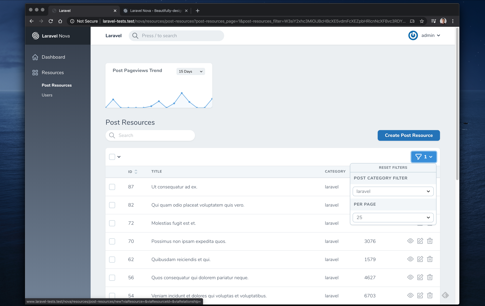

# Custom Nova Metrics Components

This package will allow you to access your resource-filters on any Laravel Nova Metric class, and will update these cards dynamically every time you select a new filter on your resources-list.

---

Charts are a great way to display graphic information on your dashboard, and with Laravel Nova you can create beautiful **Metrics Cards** really fast.

You can use these charts on your resource views as well.



Usually when you add those metrics to any resource, you'd expect the chart to be a representation of the data you are seeing in the list down below. Currently on Nova this is not possible - when you change a filter selection, the resources-list is updated, but the corresponding charts are not.


This happens because the requests to populate the list are independent from the request used to get the metrics-data. This means that updating the filters breaks the connection with the charts, leaving them outdated.

This package restores that connection, ensuring that the charts and data on-screen remain in sync.


## Install

Install via composer

```bash
composer require square1/nova-metrics
```

## Usage

You can create new metrics using the default nova commands:

```bash
php artisan nova:partition NewPartition
php artisan nova:trend NewTrend
php artisan nova:value NewValue
```

Then you only need to update your recently created metric class. Extend from one of the following classes to have access to your resource filters:

```php
use Square1\NovaMetrics\CustomTrend;
use Square1\NovaMetrics\CustomValue;
use Square1\NovaMetrics\CustomPartition;
```

For example:

```php
<?php

namespace App\Nova\Metrics;

use App\Post;
use Square1\NovaMetrics\CustomTrend;
use Laravel\Nova\Http\Requests\NovaRequest;

class NewTrend extends CustomTrend
{
    public function calculate(NovaRequest $request)
    {
        // $request->filters
    }
}
```

Let's say you have a `CategoryFilter::class` :

```php
<?php

namespace App\Nova\Filters;

use Illuminate\Http\Request;
use Laravel\Nova\Filters\Filter;

class CategoryFilter extends Filter
{

    public $component = 'select-filter';


    public function apply(Request $request, $query, $value)
    {
        return $query->where('category', $value);
    }

    public function options(Request $request)
    {
        return [
            'css' => 'css',
            'javascript' => 'javascript',
            'laravel' =>'laravel',
            'php' => 'php',
        ];
    }
}
```

This is how you can apply this filter to your `NewTrend::class` :

```php
class NewTrend extends CustomTrend
{
    public function calculate(NovaRequest $request)
        {
            $model = Post::make();
    
            if (!empty($filters)) {
                if ($request->has('filters')) {
                    // Get the decoded list of filters
                    $filters = json_decode(base64_decode($request->filters));
        
                    foreach ($filters as $filter) {
                        if (empty($filter->value)) {
                            continue;
                        }
                        // Create a new instance of the filter and apply the query to your model
                        $model = (new $filter->class)->apply($request, $model, $filter->value);
                    }
                }
            }
            
            return $this->averageByDays($request, $model, 'pageviews');
        }
}
```

---

## Known Issues

If you'd like to contribute on this package, this is a good place to start 🙂

- Wait until the first `resources-loaded` event is fired to load the cards.
- Decode the `$request->filters` in the request object.

## Credits

- [Jeff Ochoa](https://github.com/jeffochoa)
- [All Contributors](../../contributors)

## License

The MIT License (MIT). Please see [License File](LICENSE.md) for more information.
